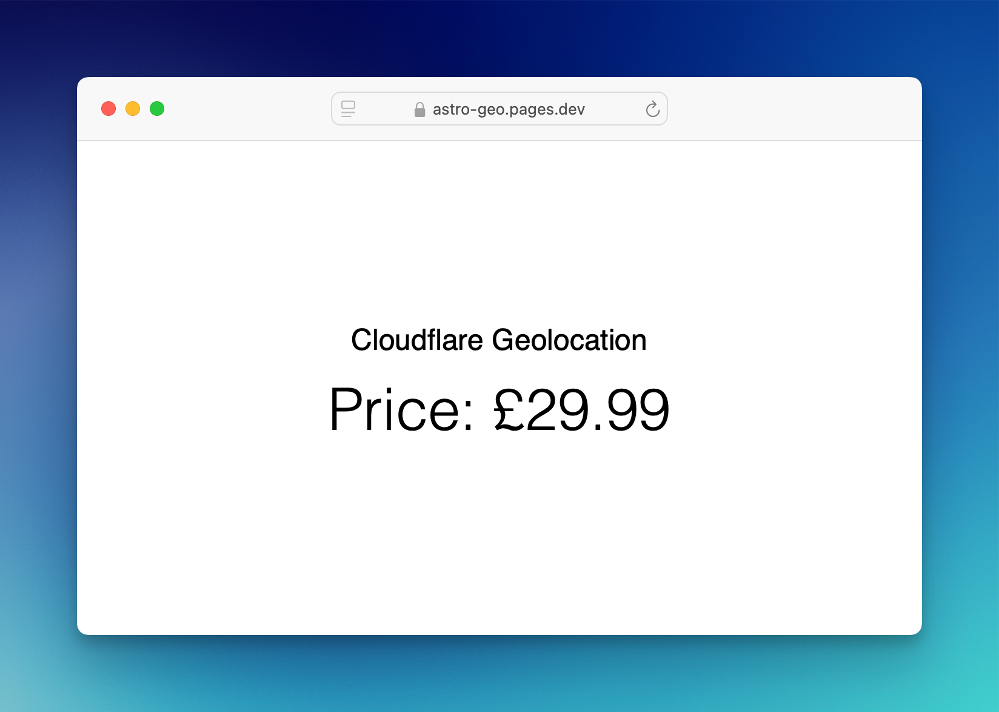
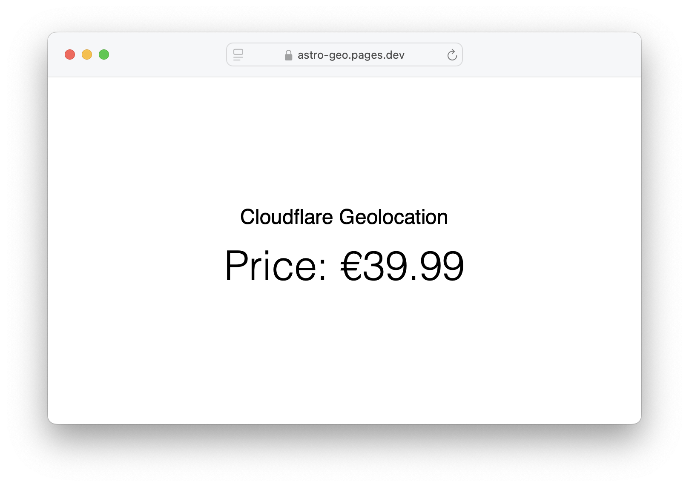
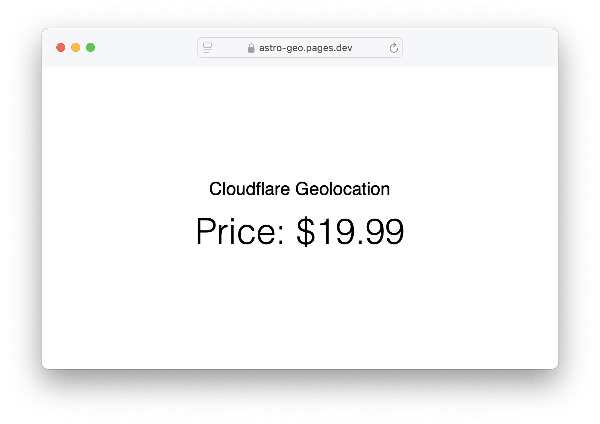

# Astro Geolocation

Here's how to use [Astro server islands](https://astro.build/blog/future-of-astro-server-islands/) and [Cloudflare geo headers](https://developers.cloudflare.com/network/ip-geolocation/) to display a different price by region.



Demo: https://astro-geo.pages.dev

## Create a new Astro project

`npm create astro@latest astro-geo`

For this simple case, set 'Empty project'/'No Typescript'/'Install dependencies'/'Initialize a new git repository' options

## Add the Cloudflare adapter

`npx astro add cloudflare`

## Enable server islands

This will be default in Astro 5.0, but for now add the following to `astro.config.mjs`

```js
export default defineConfig({
  experimental: {
    serverIslands: true,
  },
});
```

## Add a GeoLocation component

In the frontmatter, grab the Cloudflare `cf-ipcountry` header

```astro
---
const countryCode = Astro.request.headers.get("cf-ipcountry")?.toLowerCase();
---

<h1>countryCode: {countryCode}</h1>
```

## Add the component to index.astro as a server island

Just add the `server:defer` attribute: `<GeoLocation server:defer />`

## Create a new Cloudflare pages app

Publish your project to GitHub/Lab and crate a pages app from it via your Cloudflare dashboard

## Check it's working

Once built, when you visit the app in your browser you should see `countryCode: GB` or whatever your country is.

## Customise per region

Let's show £ if you're in the UK, € if you're in the EU and default to $ in the rest of the world

```astro
---
const countryCode = Astro.request.headers.get("cf-ipcountry")?.toLowerCase();

const euCodes = [ "at", "be", "bg", "hr", "cy", "cz", "dk", "ee", "fi", "fr", "de", "gr", "hu", "ie", "it", "lv", "lt", "lu", "mt", "nl", "pl", "pt", "ro", "sk", "si", "es", "se" ];

// Default usd
let geolocatedSymbol = "$";
let geolocatedPrice = "19.99";

// If gb
if (countryCode === "gb") {
  geolocatedSymbol = "£";
  geolocatedPrice = "29.99";
}
// If in eu
else if (euCodes.includes(countryCode)) {
  geolocatedSymbol = "€";
  geolocatedPrice = "39.99";
}
---

<h2>
  Price: {geolocatedSymbol + geolocatedPrice}
</h2>
```

## Done!

Push your code up and check the build in your browser. If you have a vpn, try switching between US/UK/EU servers and reloading.

### View live demo: [astro-geo.pages.dev](https://astro-geo.pages.dev)

If you need an [Astro](https://www.blackspike.com/services/astro-vue-websites) website, do [get in touch](https://www.blackspike.com/contact)!




